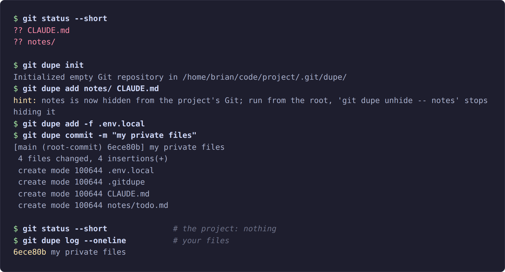

# git-dupe

[](https://github.com/BrianWeiHaoMa/git-dupe/actions/workflows/ci.yml)
[](https://github.com/BrianWeiHaoMa/git-dupe/releases/latest)
[](LICENSE)

git-dupe keeps the files in a checkout that are yours and not the project's — `.env.local`,
notes, plans, scratch scripts, editor settings, your own instructions file for a coding
agent — under version control, out of the project's repository, and in sync between your
machines. They stay where their tools expect them in the working tree, and their history
lives in a second, ordinary Git repository inside the project's `.git`. Public work is
`git …`; private work is `git dupe …`, with Git's own commands, options, output, and exit
codes.

"Dupe" as in a duplicate of your checkout that only you see; it has nothing to do with
duplicate files. Linux only, Git 2.43.0 or newer below 3.0.0, and young: what it does not
do yet is under [Limits](#limits), and `git dupe detach` takes it back out.



## Quick start

In a clone of a project, where `notes/` holds notes of yours and `.env.local` your
settings, a file the project's `.gitignore` ignores, run from the root:

```sh
git dupe init                             # attach an empty private repository
git dupe add notes/                       # hide notes/ from the project and stage it
git dupe add -f .env.local                # a file the project ignores takes -f
git dupe commit -m "Private files"        # a private commit: git log never shows it
git dupe remote add origin <private-url>  # an empty repository of your own
git dupe push -u origin HEAD              # send the private history there
git dupe clone <private-url>              # in a clone elsewhere: the files come back
```

The project then holds:

```text
project/
├── .env.local     private
├── .git/dupe/     the private repository
├── .gitdupe       private: lists notes, the directory you hid
├── notes/         private
├── README.md      public
└── src/           public
```

`git status` lists none of the private files, `git log` shows no private commit, and
`git dupe status` lists none of the project's. `<private-url>` is a repository on a host
or a disk you trust, with the project's branch as its default branch, which
`git dupe clone` checks out; on a disk, `git init --bare -b main` makes one for a project
on `main`. git-dupe refuses a URL of the project's own repository. From then on,
`git dupe pull` and `git dupe push` move private work between machines.

`git dupe detach` is the way out: it removes the private repository and the exclude
rules, leaves every file on disk, and refuses, without `--force`, while private work is
uncommitted or on no remote.

## Install

git-dupe runs on Linux and needs Git 2.43.0 or newer, below 3.0.0. It is one executable,
`git-dupe`, which Git runs for `git dupe …` when it stands in a directory on `PATH`.

**From a release.** Download `git-dupe-<version>.tar` from the
[releases](https://github.com/BrianWeiHaoMa/git-dupe/releases) and follow its `INSTALL`
note, which installs the executable and the manual page, with `~/.local/bin` on `PATH`
and `~/.local/share/man` on the manual path:

```sh
tar -xf git-dupe-<version>.tar
cd git-dupe-<version>
mkdir -p ~/.local/bin ~/.local/share/man/man1
cp git-dupe ~/.local/bin/
cp git-dupe.1 ~/.local/share/man/man1/
```

The release's executable is for x86-64 Linux with the GNU C library 2.34 or newer; on
another machine, or where it does not start, install from source. Check the Git before
the library: `git --version` must say 2.43.0 or newer. Ubuntu 24.04 ships 2.43.0;
Ubuntu 22.04 ships 2.34 and Debian 12 ships 2.39, so there a newer Git comes first, from
a backport, a PPA such as Ubuntu's `git-core`, or a build from source.

**From source.** In a clone of this repository, with Rust installed through rustup, which
installs the toolchain the repository pins on first use:

```sh
cargo install --path .
```

That installs the executable alone: `git dupe help` works with nothing else, while
`man git-dupe` and `git dupe --help` need the manual page, `git-dupe.1` in a release
archive, installed as its `INSTALL` says.

## What it is for

- **Files the project should never see.** `.env.local`, `.vscode/`, notes, plans, and
  scratch scripts, versioned with a history of their own and brought to every machine
  you work on: `git dupe push` and `git dupe pull` move them through a private remote of
  your choosing.
- **Your own instructions for a coding agent.** A project that keeps no `AGENTS.md` or
  `CLAUDE.md`, or accepts none, still lets you keep yours: `git dupe add CLAUDE.md`, or
  `CLAUDE.local.md` beside the project's own, makes it private, with `-f` where the
  project ignores it. Your agent reads it where it expects it, the project never sees
  it, and once it is committed and pushed, `git dupe clone` brings it to every new
  clone. A file only the project tracks is refused: a path belongs to one repository or
  the other.
- **Agents and scripts.** git-dupe adds no prompts of its own. `git dupe status
  --porcelain` lists the private changes, a refusal is one `fatal:` line with exit
  status 128, and a usage error exits 129.

## How it works

- The **private repository** is an ordinary Git repository at `.git/dupe`, inside the
  project's own `.git`, whose working tree is the project's. Plain Git can read it, and
  clone, fetch, or push from it. It has its own object store, and every Git process
  git-dupe runs against it has the object-directory variables cleared, so the two
  repositories share no objects: the project's `git gc` and `git prune` never touch it.
  Being inside `.git`, it is never committed and never cloned with the project, which is
  the point; `git dupe clone` is the deliberate way back.
- A **hidden path** is one the project's Git ignores through rules git-dupe maintains in
  `.git/info/exclude`, so that `git status`, `git add -A`, and a public commit never see
  it: `.gitdupe`, a private file at the root that lists the paths you hide, one per line;
  every path it lists; and every file tracked privately, as a file you add is. Nothing
  versioned is added to the project.
- Three commands get the meaning a shared working tree needs: `git dupe status` and
  `git dupe add` act on the hidden paths instead of every file of the project, and
  `git dupe clean` cleans the project while sparing them. `git dupe stash -u` and `-a`,
  which would stash the whole project, are refused, and so are a `push`, `pull`,
  `fetch`, `remote`, or `clone` naming the project's own repository. Every other Git
  command, `commit`, `diff`, `log`, `restore`, `switch`, `merge`, runs against the
  private repository unchanged.
- **What it writes.** Of its own accord, git-dupe writes `.git/dupe`, a marked region of
  `.git/info/exclude` (and `.git/info` itself when it is missing), and `.gitdupe`, and
  nothing else: no hook, no daemon, no edit to `.gitignore` or to the project's
  configuration, and the only program it runs is `git`.

## Limits

- **Linux only, for now.** The specification promises behavior on Linux, on a local,
  case-sensitive filesystem, and that is what the suite runs under. Nothing known rules
  macOS out, but its default filesystem is case-insensitive, outside the envelope, so a
  port is more than a rebuild; say so in an issue if you want one.
- **Git 2.43.0 or newer, below 3.0.0.** No single feature needs it; it is the floor the
  suite covers, and Ubuntu 24.04's stock Git. See [Install](#install) for older
  distributions.
- **No encryption.** The private remote is the trust boundary: an `.env.local` you push
  sits there in plaintext, so push to a remote you would trust with it, or keep secrets
  out of what you add.
- **Plain `git` is not guarded.** To the project's Git a private file is an ignored file:
  `git clean -x` deletes it, `git stash -a` stashes it, `git add -f` makes it public, and
  a public pull or checkout that brings a file to its path overwrites it. Commit private
  work first; `git dupe restore .`, from the root, brings back every privately tracked
  file as last staged, and `git dupe clean` cleans the project while sparing them. Public
  `git stash -u`, `git add -A`, and `git add .` leave them alone, as they leave any
  ignored file.
- **The main working tree only.** `git dupe` in a linked worktree is refused and names the
  main one. The exclude rules apply in every worktree, since `.git/info/exclude` is
  shared, but the private files exist only in the main one; whether linked worktrees
  should share one private repository or each get their own is an open question.
- **Up to 1,000 hidden paths.** The hidden paths not below another one are passed to Git
  on one command line, 128,000 bytes of path in all; a list that does not fit is refused,
  never truncated. Files below a hidden directory are not counted: a `notes/` with
  thousands of files is one path.

## Compared with what you may already use

- **`.git/info/exclude` by hand, or `git update-index --skip-worktree`.** Hides a path
  from the project and does nothing else: no history, and nothing on the next machine.
  git-dupe maintains that exclude file for you and adds the history and the sync.
- **The bare-repository dotfiles trick, vcsh, yadm, chezmoi.** The first two are the same
  mechanism as git-dupe's, a Git directory kept elsewhere with a working tree it does not
  own, and all four are built for `$HOME`: none knows about a project's exclude file or
  its remotes. git-dupe is that pattern scoped to one project and kept inside its `.git`,
  with the exclude rules maintained for you, `status` and `add` confined to your files,
  and the forms that would stash the whole project or push to the project's remote
  refused. If the trick already works for you, keep it.
- **git-crypt, sops, age.** Encrypt files that stay in the team's repository. git-dupe
  keeps files out of it, and encrypts nothing. The private repository is an ordinary one,
  so a tool like these could run inside it, untested.
- **A submodule.** Its gitlink and `.gitmodules` are committed, so the project sees it,
  and it holds a subdirectory, never a file at the root such as `.env.local`.
- **A gitignored folder, or symlinks from a dotfiles repository.** Hidden only where the
  team's `.gitignore` happens to name it, versioned only if the dotfiles repository knows
  every project, and gone from every fresh clone until you set it up again.

## Questions

- **Does the private repository come along when someone clones the project?** No. `.git`
  is not part of a clone, so a clone holds neither `.git/dupe`, `.gitdupe`, nor the
  exclude rules: nothing of yours is in the project. In a fresh clone you run
  `git dupe clone <private-url>`, which writes the files that are missing and keeps,
  naming each, any that are already there.
- **Two people on the same project?** Each clone has its own `.git/dupe`, its own
  `.gitdupe`, and its own private remote. Nothing shows in the project for anyone else.
- **My agent runs `git add -A` all day.** Anything that finds files through the ignore
  rules, `add -A`, `add .`, `commit -a`, `status`, never picks up a hidden path. What
  writes the index from an explicit tree or patch can: `add -f`, or a merge, rebase, or
  patch that brings a file to that path. The path is then tracked by both repositories,
  stays hidden, and every git-dupe command warns until one side lets go.
- **What if the team's `.gitignore` has a `!` rule for my path?** `.gitignore` outranks
  `info/exclude`, so the path is exposed. git-dupe names it, and the deciding rule with
  its file and line, after every command until the rule or the path changes. Nothing is
  lost.
- **What if the project later adds a file at my path?** A public pull or checkout
  overwrites yours. Commit private work first; `git dupe restore` brings it back; then
  one repository has to give the path up.
- **How do I get out?** `git dupe detach`: it removes `.git/dupe` and the exclude rules,
  leaves every file on disk, `.gitdupe` included, and warns which paths the project can
  now see. Without `--force` it refuses while anything is uncommitted or on no remote.
  Then delete the executable.

## Built to a specification

git-dupe is new, and a tool that writes inside `.git` has to earn trust, so it is held to
one document. [`PRODUCT_SPECIFICATION.md`](PRODUCT_SPECIFICATION.md) says, in numbered
lines, what git-dupe does, the guarantees it keeps, and what it never does;
[`TECHNICAL_SPECIFICATION.md`](TECHNICAL_SPECIFICATION.md) says how each guarantee holds.
The code follows both, and a change of behavior amends the specification first. The
scenario suite, the specification's own `Done when` among it, runs under Git 2.43.0 and
2.56.0, the oldest and the newest release it lists, on every push
([CI](https://github.com/BrianWeiHaoMa/git-dupe/actions/workflows/ci.yml)), and before a
release under every minor release between them, fourteen at this writing, each built
from source, so that a change in Git shows up as a failing release before it shows up
as a bug report.

Read the specification beside the code and judge for yourself whether git-dupe keeps
what it promises inside its `Operating envelope`. When something you ran does not go as
a line says, [`CONTRIBUTING.md`](CONTRIBUTING.md) says how to report it, and the issue
form asks for exactly that.

## Read more

- `git dupe help`, and `git dupe help <command>` for each command git-dupe adds or
  changes: a screen each, from the executable alone.
- `man git-dupe`, where the manual page is installed: the commands, a quick start,
  examples, and explanations.
- [`PRODUCT_SPECIFICATION.md`](PRODUCT_SPECIFICATION.md): what git-dupe does and
  guarantees, and what it does not.
- [`TECHNICAL_SPECIFICATION.md`](TECHNICAL_SPECIFICATION.md): how each guarantee holds.
- [`CONTRIBUTING.md`](CONTRIBUTING.md): what governs a change, how to report a problem,
  and how to run the checks.
- [`CHANGELOG.md`](CHANGELOG.md): what changed in each release.
- [`RELEASING.md`](RELEASING.md): what a release holds and how one is made.

## License

MIT, in [`LICENSE`](LICENSE).
